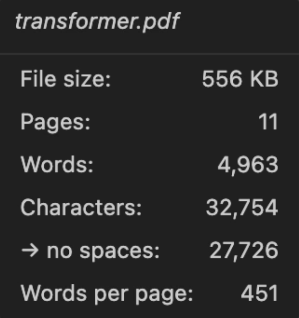

# PDF Word Count

An extension for VS Code and Cursor that displays the word count of PDF documents in the status bar, along with more
detailed statistics (file size, page count, character count, etc.) about a PDF upon hover.

  

Word count of a PDF displayed in the status bar

  

PDF statistics displayed in the status bar tooltip upon hover

Feel free to report any bugs or feature requests as [issues](https://github.com/Sam-Armstrong/pdf-word-count/issues)
on GitHub. Pull requests are also welcome!

<!-- ## Requirements -->

<!-- ## Extension Settings -->

## How it works

The extension uses [pdf.js](https://mozilla.github.io/pdf.js/) to pull positioned text items from each page
of a PDF document, then converts these into a block of continuous text by inserting spaces where the horizontal
gap between items is large relative to the font height, starting a new line when the vertical position changes or
an item reports an end of line. Words split by a hyphen at a line break are rejoined, so they don't get counted as
separate words. The word count is then calculated as the number of whitespace-separated tokens in the resulting text,
excluding any tokens that are just made up of punctuation.

## Known Issues

...

## Release Notes

### Pre-Release v0.0.3

Add pdfjs bundling to avoid extension import issue, expand the test suite to improve the extension robustness.

### Pre-Release v0.0.2

Add Open VSX deployment and update extension description and notes.

### Pre-Release v0.0.1

Initial release of pdf-word-count, a lightweight extension that displays the word count of PDF documents in the status bar.
Only deployed to the VS Code Marketplace in this initial pre-release.
